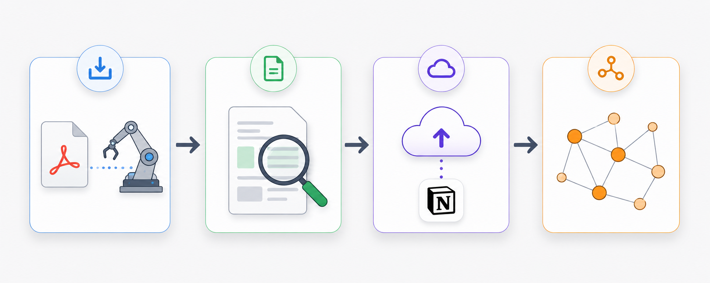
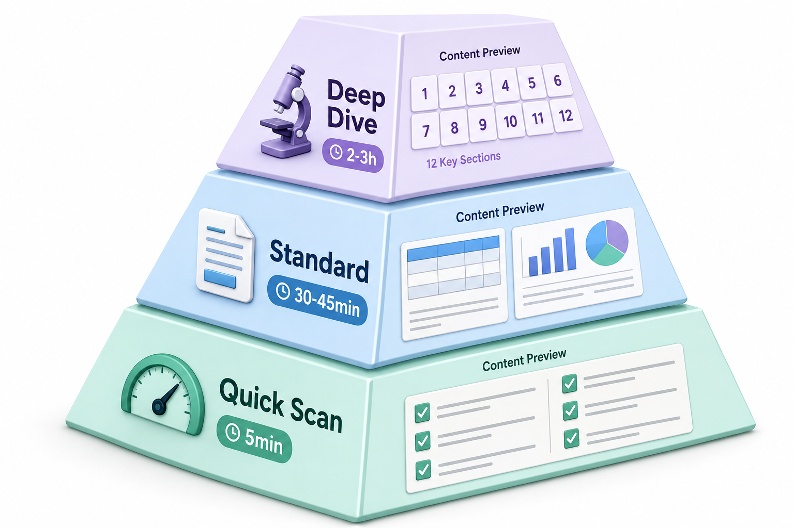

<p align="center">
  
</p>

<h1 align="center">ReadMap</h1>

<p align="center">
  <b>Community-driven pipeline for turning scattered papers into a structured knowledge base.</b>
</p>

<p align="center">
  <a href="#quick-start"></a>
  <a href="prompts/"></a>
  <a href="docs/notion-setup.md"></a>
  <a href="https://github.com/nilbuild/readmap/discussions"></a>
</p>

<p align="center">
  
</p>

<p align="center">
  
</p>

---

## Why ReadMap?

You read dozens of papers. You highlight, you annotate, you take notes.

But six months later:

- **Where** did you file that paper on causal probing?
- **How** does it relate to the new arXiv preprint you just opened?
- **What** were the real weaknesses — not the authors' claims?
- **Which** follow-up papers should you read next, and in what order?

**Zotero stores. Obsidian links. Notion organizes. None of them connect.**

ReadMap is the missing pipeline between papers and your brain.

<p align="center">
  
</p>

<p align="center">
  
</p>

## The 3-Tier Reading System

Not every paper deserves 3 hours. ReadMap enforces a **tiered investment strategy** based on relevance:

| Level | Time | When to use | Output |
|-------|------|-------------|--------|
| **⚡ Quick Scan** | 5 min | Screening a new preprint | Verdict + archive to Reading Queue |
| **📖 Standard** | 30-45 min | Worth learning from | Cheat sheet + method table + Mermaid diagram + Notion sync |
| **🔬 Deep Dive** | 2-3 h | Core to your research | Full 12-section document + Notion detail page + Wiki update |

## Deep Dive: The 12-Section Methodology

The soul of ReadMap. Every Deep Dive follows the same skeleton — no more blank-page syndrome:

1. **Paper Info & TL;DR**
2. **Section-by-section reading** along the paper's narrative
3. **Method & experiment teardown** (tables + figure interpretation)
4. **Structure & logic flow** (Mermaid pipeline + dependency diagrams)
5. **Field positioning & related work map** (Mermaid landscape)
6. **Critical Lens** (reproducibility / rigor / overclaim / boundaries)
7. **Reviewer Simulation** (score + 3 weaknesses + rebuttal preview)
8. **Reproducibility & code assessment**
9. **Aha Moments & Spotlight** (transferable insights)
10. **Relation to my research** (mapped to active projects)
11. **Extended reading suggestions** (every entry must have a clickable link)
12. **One-Page Quick Reference** (cheat card)

> Standard covers sections 1, 3, 4, 10, 11, 12. Quick Scan covers section 1 only.

<p align="center">
  
</p>

## Two-Track Architecture

| Content | Notion | Wiki (Quartz) |
|---------|--------|---------------|
| Full reading notes | ✅ Warehouse | ❌ |
| Cheat sheets | ✅ Daily use | ✅ Structured browsing |
| Knowledge maps / method genealogies | ❌ | ✅ Graph view + Mermaid |
| Concept definitions | ✅ Detailed cards | ✅ Knowledge graph |
| Methodology SOPs | ✅ Editable | ✅ Shareable |

**Notion is the warehouse. Wiki is the showroom.**

<p align="center">
  
</p>

## Quick Start

```bash
# 1. Clone & install
git clone https://github.com/nilbuild/readmap.git
cd readmap
python -m venv .venv && source .venv/bin/activate
pip install -e "."

# 2. Configure
cp .env.example .env
# Fill in your Notion token and database IDs

# 3. Download a paper
python -m readmap.fetch_paper https://arxiv.org/abs/2401.12345

# 4. Read with prompts, then sync to Notion
python -m readmap.sync_notion papers/2401.12345/deep-dive.md
```

See [docs/notion-setup.md](docs/notion-setup.md) for step-by-step Notion database setup.

<p align="center">
  
</p>

## Project Structure

```
readmap/
├── prompts/                    # Core methodology assets
│   ├── quick-scan.md
│   ├── standard.md
│   ├── deep-dive.md            # 12-section structure
│   └── reviewer-simulation.md
├── src/readmap/                # Python package
│   ├── config.py               # Zero-hardcoded config
│   ├── markdown_parser.py      # Markdown → Notion blocks
│   ├── sync_notion.py          # Notion sync
│   ├── fetch_paper.py          # Download + MinerU parse
│   ├── build_wiki.py           # Wiki knowledge maps
│   └── pipeline.py             # Full orchestration
├── templates/                  # Output templates + Mermaid
├── wiki/                       # Quartz site template
└── docs/
    ├── notion-setup.md
    └── assets/                 # Logo, diagrams, divider
```

<p align="center">
  
</p>

## Notion Database Schema

ReadMap expects **4 databases**. Property names are configurable — edit `src/readmap/notion_client.py` if you prefer English.

| Database | Key Properties |
|----------|---------------|
| **Literature** | 论文标题, 作者, 年份, 会议期刊, 精读模式, Reviewer评分, 速查卡, 主题 |
| **Reading Queue** | 论文标题, 来源, 状态, 链接, 推荐理由 |
| **Projects** | 项目名, 状态, 领域, 关联论文 |
| **Concept Cards** | 概念名, 一句话定义, 成熟度, 类型, 相关论文 |

Full schema + setup guide → [docs/notion-setup.md](docs/notion-setup.md)

<p align="center">
  
</p>

## Share with the community

If ReadMap helps your research workflow, please consider sharing it. It really does help!

<p align="center">
  <a href="https://twitter.com/intent/tweet?text=ReadMap%20%E2%80%94%20turn%20scattered%20papers%20into%20a%20structured%20knowledge%20base&url=https://github.com/nilbuild/readmap" target="_blank"></a>
  <a href="https://www.linkedin.com/sharing/share-offsite/?url=https://github.com/nilbuild/readmap" target="_blank"></a>
  <a href="https://www.reddit.com/submit?url=https://github.com/nilbuild/readmap&title=ReadMap%20%E2%80%94%20Community-driven%20paper%20reading%20pipeline" target="_blank"></a>
</p>

<p align="center">
  
</p>

## Development

```bash
# Optional: PDF parsing with MinerU
python -m venv .venv-mineru
source .venv-mineru/bin/activate
pip install mineru[all]

# Optional: Wiki site with Quartz
npm install -g quartz
npx quartz build --serve
```

## Contribution

- Add new prompt variations
- Improve the Markdown → Notion parser
- Share your reading templates
- Discuss ideas in [Discussions](https://github.com/nilbuild/readmap/discussions)
- Spread the word

## Thanks to all contributors ❤

<a href="https://github.com/nilbuild/readmap/graphs/contributors">
  
</a>

## License

MIT
