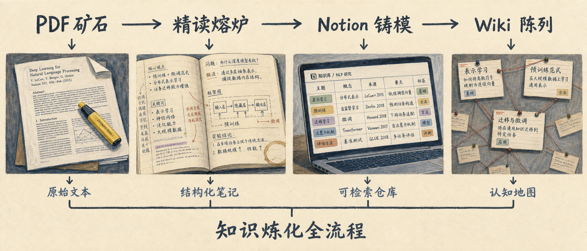

<p align="center">
  
</p>

<h1 align="center">ReadMap</h1>

<p align="center">
  <b>阅读不是囤积，是炼化。<br>知识不是碎片，是晶体。</b>
</p>

<p align="center">
  <a href="#quick-start"></a>
  <a href="prompts/"></a>
  <a href="docs/notion-setup.md"></a>
  <a href="https://github.com/Sunrich-HT/ReadMap/discussions"></a>
</p>


<p align="center">
  
</p>

---

## Why ReadMap?

You read dozens of papers. You highlight, you annotate, you take notes.

But six months later:

- **Where** did you file that paper on causal probing?
- **How** does it relate to the new arXiv preprint you just opened?
- **What** were the real weaknesses — not the authors' claims?
- **Which** follow-up papers should you read next, and in what order?

**Zotero stores. Obsidian links. Notion organizes. None of them connect.**

ReadMap is the missing pipeline between papers and your brain.


<p align="center">
  
</p>

## 精读不是把论文翻译成更专业的中文

而是把它拆到最基本的问题，看清它究竟解决了什么、为什么有效、证据够不够，
以及有没有用复杂包装掩盖一个普通技巧。

判断标准只有一条：**遮住标题、作者、会议和所有新术语后，仅凭问题、机制和证据，
还能不能判断这个工作值不值得相信？**

### 八问结构

一份填满十二节的文档和一段两句话的摘要，一旦都归档为「Deep Dive」，看起来一样权威。
篇幅不是证据强度。八问改变的不是长度，而是这份文档**为什么存在**：

| | |
|---|---|
| **1 三十秒讲清楚** | 解决什么？关键办法？最终判断？ |
| **2 第一性原理** | 不用论文术语：世界里原本有什么矛盾？哪两件事不可兼得？ |
| **3 能在脑中运行的例子** | 拆掉术语 → 最小玩具世界 → 回到严格表达（比喻的边界要写明） |
| **4 作者真正新增了什么** | 最小创新单元；新增了哪个自由度，又带来什么新风险 |
| **5 为什么理论上应该有效** | 机制解释，不能只说结果涨了 |
| **6 证明了什么、没证明什么** | 直接证据 / 间接证据 / 作者推断 / 我的推断 / 尚未验证，分开列 |
| **7 承重审计** | 创新是否真的承重？有无更便宜替代？增益是否只来自额外预算？ |
| **8 最终判决** | 择一判决 + 主张降级 + **只能一项**的下一步 |

第 7 问收口到单一判决问题，而不是罗列七八条通用局限：
**如果只能推翻一个假设，应该推翻哪一个？哪个结果一旦消失论文就坍塌？最小判决实验是什么？**

### 四个强制字段

这些区分只存在于文字里时，谁也拦不住它们悄悄消失。所以它们进了 schema 和数据库：

| 字段 | 取值 | 它拦住的问题 |
|---|---|---|
| `doc_type` | 单篇精读 / Radar 综述 / 自主教程 / 复现报告 | 自动综述冒充单篇精读 |
| `evidence_level` | L1 摘要 → L2 原文 → L3 图表 → L4 代码数据 → L5 局部复现 | 篇幅冒充证据强度 |
| `project_relation` | **默认 none** / cite / design / warning / analogy | 每篇论文都被吸附到当前项目 |
| `closure` | 阅读完成 → 证据核验 → 复现 → 迁移实验 → 已进入论文 | 「写完报告」冒充「问题闭环」 |

`project_relation` 默认是 `none`：**相关性需要被论证，而不是被假定。**
改成任何其他值都必须给出 `relation_reason` —— `cite` 要说进入哪一节，
`design` 要说改哪个对照或指标。认真读完后判断「不相关」不是失败。

### 证据标签

正文里每个关键数字都要说明"我是怎么知道的"，同步到 Notion 后按来源着色：

`[Paper/Table 2]` `[Appendix C.4]` `[Code inspected]` `[Recomputed]` `[My inference]` `[Unverified]`

无标签的数字一律按 `[Unverified]` 计。**"读过完整 PDF 所以置信度高"不等于"关键数字已被独立核验"。**


## Two-Track Architecture

| Content | Notion | Wiki (Quartz) |
|---------|--------|---------------|
| Full reading notes | ✅ Warehouse | ❌ |
| Cheat sheets | ✅ Daily use | ✅ Structured browsing |
| Knowledge maps / method genealogies | ❌ | ✅ Graph view + Mermaid |
| Concept definitions | ✅ Detailed cards | ✅ Knowledge graph |
| Methodology SOPs | ✅ Editable | ✅ Shareable |

**Notion is the warehouse. Wiki is the showroom.**


## Quick Start

```bash
# 1. Clone & install
git clone https://github.com/Sunrich-HT/ReadMap.git
cd ReadMap
python -m venv .venv && source .venv/bin/activate
pip install -e ".[figures]"        # [figures] pulls in figure-extractor

# 2. Configure (only needed for the Notion half)
cp .env.example .env

# 3. One command: fetch → parse → extract every figure and table → skeleton
readmap read https://arxiv.org/abs/2401.12345

# 4. Read the paper and fill in the eight questions, then:
readmap gate  papers/2401.12345/reading.md    # refuse to file a note that misreports itself
readmap sync  papers/2401.12345/reading.md    # → Notion
readmap wiki                                   # → Quartz knowledge map
```

`readmap read` is the whole retrieval half in one command. Reading is yours;
`gate` and `sync` close the loop. Commands that never touch Notion — `read`,
`figures`, `gate` — run without any credentials configured.

### 多模态：图表抠取

图表通过 [figure-extractor](https://github.com/Sunrich-HT/figure-extractor) 接入，
它是**可选依赖**：装了就用，没装则降级并明确说明缺口，而不是静默跳过。

**抠取是穷尽的，选择不是。** 论文里每一个 Figure / Table / Scheme / Algorithm
（含 `Extended Data Fig.`、`Supplementary Table`、章节式 `Figure 2.1`、附录 `Figure B.1`）
都会被抠出来，连同 300 dpi 裁剪、caption、页码、正文引用次数和裁剪质量评分写进 manifest。

但**不是所有图表都值得读**。哪几张承载论证，取决于论文自身的论证结构，
计数器看不见。所以骨架里给的是一份**目录**，不是一堆插图：

```
| 编号 | 页 | 引用次数 | tier | 状态 | 文件 | Caption |
```

tier 只反映引用频次，是分诊起点，不是判决。进正文的通常只有支撑核心结论的那 2–4 张。
标为 `suspect` / `failed` 的裁剪会被标出来，引用前先核对 `contact_sheet.jpg`。

See [docs/notion-setup.md](docs/notion-setup.md) for step-by-step Notion database setup.


## Project Structure

```
ReadMap/
├── prompts/
│   ├── reading.md              # 八问结构（当前）
│   ├── quick-scan.md           # legacy
│   ├── standard.md             # legacy
│   ├── deep-dive.md            # legacy 12-section
│   └── reviewer-simulation.md
├── src/readmap/
│   ├── schema.py               # 文档类型 / 证据等级 / 项目关系 / 决策闭环
│   ├── compose.py              # 八问骨架生成
│   ├── gate.py                 # 同步前的质量门
│   ├── figures.py              # figure-extractor 接入（可选依赖）
│   ├── notes.py                # frontmatter 解析（唯一实现）
│   ├── markdown_parser.py      # Markdown → Notion blocks（含证据标签着色）
│   ├── sync_notion.py          # Notion 同步
│   ├── fetch_paper.py          # 下载 + MinerU 解析
│   ├── build_wiki.py           # Wiki 认知地图
│   ├── config.py               # 单一配置源（惰性校验）
│   └── cli.py                  # readmap read / gate / figures / sync / wiki
├── tests/                      # pytest
├── templates/ · wiki/ · docs/
```


## Notion Database Schema

ReadMap expects **4 databases**. Property names are configurable — edit `src/readmap/notion_client.py` if you prefer English.

| Database | Key Properties |
|----------|---------------|
| **Literature** | 论文标题, 作者, 年份, 会议期刊, 精读模式, Reviewer评分, 速查卡, 主题 |
| **Reading Queue** | 论文标题, 来源, 状态, 链接, 推荐理由 |
| **Projects** | 项目名, 状态, 领域, 关联论文 |
| **Concept Cards** | 概念名, 一句话定义, 成熟度, 类型, 相关论文 |

Full schema + setup guide → [docs/notion-setup.md](docs/notion-setup.md)


## Share with the community

If ReadMap helps your research workflow, please consider sharing it. It really does help!

<p align="center">
  <a href="https://twitter.com/intent/tweet?text=ReadMap%20%E2%80%94%20turn%20scattered%20papers%20into%20a%20structured%20knowledge%20base&url=https://github.com/Sunrich-HT/ReadMap" target="_blank"></a>
  <a href="https://www.linkedin.com/sharing/share-offsite/?url=https://github.com/Sunrich-HT/ReadMap" target="_blank"></a>
  <a href="https://www.reddit.com/submit?url=https://github.com/Sunrich-HT/ReadMap&title=ReadMap%20%E2%80%94%20Community-driven%20paper%20reading%20pipeline" target="_blank"></a>
</p>


## Development

```bash
# Optional: PDF parsing with MinerU
python -m venv .venv-mineru
source .venv-mineru/bin/activate
pip install mineru[all]

# Optional: Wiki site with Quartz
npm install -g quartz
npx quartz build --serve
```

## 作为 agent skill 使用

仓库根目录有 [`SKILL.md`](SKILL.md)（标准 YAML frontmatter），
skill-aware 的 agent（Claude Code / Codex / Kimi）可自动加载。
把仓库放进你的 skills 目录后，一句话即可触发：

> 用 ReadMap 精读这篇论文：<url>

方法论、三条硬规则、必填元数据和图表降级契约都在 SKILL.md 里，
不需要在提示词里重复。

> **注意**：Notion AI 没有 skill 加载器，不会去读这个仓库。
> 在 Notion 里使用时，把 SKILL.md 的内容放成一个 Notion 页面再引用它。

## Development

```bash
pip install -e ".[dev]"
pytest -q
```

## Contribution

- Add new prompt variations
- Improve the Markdown → Notion parser
- Share your reading templates
- Discuss ideas in [Discussions](https://github.com/Sunrich-HT/ReadMap/discussions)
- Spread the word

## 路线图 / 待办

> 每篇论文都是矿石，ReadMap 是你的熔炉。<br>炼化流程可视化，知识结晶有迹可循。

<p align="center">
  
</p>

### 已落地 ✅

- [x] 八问精读结构 + 四个强制字段（文档类型 / 证据等级 / 项目关系 / 决策闭环）
- [x] 证据标签体系，Notion 内按来源着色
- [x] 同步前质量门（元数据、生成残留、标签污染、评分制式、结论重复、决策闭环）
- [x] 多模态图表抠取接入（figure-extractor，穷尽抠取 + 分诊信号）
- [x] Markdown → Notion 一键同步
- [x] Wiki 认知地图自动生成（Quartz）
- [x] MinerU 结构化 PDF 解析

### 正在炼化 🔄

- [ ] **论文关系图谱 2.0** — 自动提取引用关系，生成交互式引用网络图
      （`fetch_paper.py` 已接 Semantic Scholar，数据入口是现成的）
- [ ] **知识晶体成熟度面板** — 追踪每个概念的演进：🌱 种子 → 🌿 在长 → 🌳 成熟 → 💎 结晶
- [ ] **领域地图自动构建** — 目前 wiki 的 mindmap 仍是模板占位，只有论文节点列表是自动生成的
- [ ] **知识炼化流程可视化** — 将论文阅读→笔记→归档的完整链路做成交互式时间轴

### 远景结晶 🔮

- [ ] **个人知识图谱 3D 可视化** — 把 Notion + Wiki 的知识网络立体呈现
- [ ] **阅读习惯量化分析** — 每月生成「阅读报告」：精读深度、领域分布、知识增长曲线
- [ ] **跨论文概念溯源** — 追踪一个概念在多篇论文中的演变脉络
- [ ] **知识晶体市场** — 分享你的精读模板和方法论，让知识流动起来

## License

MIT
