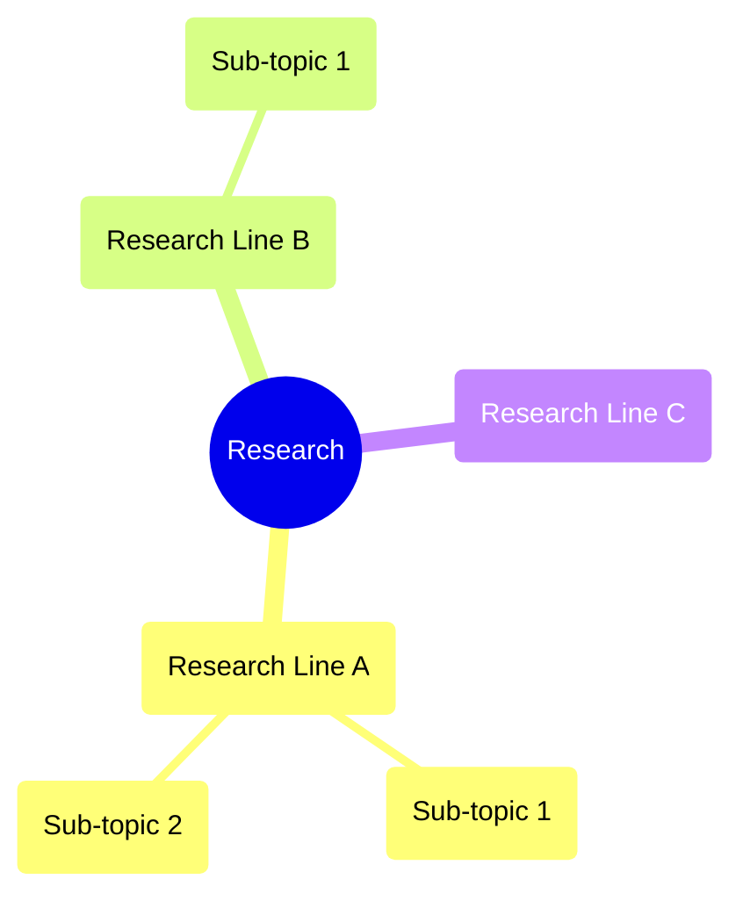

# 🏠 Research Knowledge Map

> **Notion is the warehouse; this is the showroom.**
>
> Full reading notes live in Notion. This site displays structured knowledge networks and maps.

---

## 🗺️ Active Research Lines

> Edit the mindmap above to reflect your own research lines. Update `.env` with `RESEARCH_LINES` for auto-generation.

---

## 📊 Research Dashboard

| Research Line | Active Project | Papers | Concepts | Maturity |
|--------------|----------------|--------|----------|----------|
| (Example A)  | —              | —      | —        | 🌱       |
| (Example B)  | —              | —      | —        | 🌿       |

> This table is auto-generated by `build_wiki.py` from your Notion databases.

---

## 📈 Latest Activity

- **Recent reading:** (auto-populated)
- **Recent concept:** (auto-populated)
- **Queue:** (auto-populated)

---

## 🔗 Quick Links

- 📚 Notion Literature Database
- 🧠 Notion Concept Cards
- 🔬 Notion Project Tracker
- 📖 Notion Reading Queue
- 📐 [Methodology](methodology/)

---

## 🌐 Graph View

Click **Graph View** (top-right) to explore the full knowledge network.
